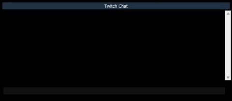

# 🎮 EQ-Style Twitch Chat Overlay

A nostalgic Twitch chat overlay styled like the classic EverQuest UI.

This standalone Python app creates a draggable, resizable Twitch chat window that looks just like the original EQ chat box. Fully customizable and works with any Twitch channel you log into — no stream overlays required.



---

## ✨ Features

- ✅ EverQuest-style UI with draggable window
- ✅ Twitch chat viewer and sender
- ✅ Built-in OAuth login via browser (no secrets required)
- ✅ Emote filtering (cleans up spam)
- ✅ Right-click context menu:
  - **Resize** → use system borders to resize freely
  - **Close** → exit the overlay
- ✅ Press `Enter` or `Escape` to exit resize mode and return to overlay view

---

## 🛠 Installation

### 1. Clone the Repo

```bash
git clone https://github.com/yourusername/eq-twitch-chat.git
cd eq-twitch-chat
```

### 2. Install Requirements

You can install the required packages via pip:

```bash
pip install -r requirements.txt
```

If you don’t have a `requirements.txt`, use this:

```bash
pip install pillow requests irc
```

---

## 🔐 Twitch Setup (One-time Setup for Developer)

Before you or users can authenticate with Twitch:

1. Go to [https://dev.twitch.tv/console/apps](https://dev.twitch.tv/console/apps)
2. Click **Register Your Application**
   - **Name**: `EQChatOverlay`
   - **OAuth Redirect URL**: `http://localhost:8080`
   - **Category**: Chat Bot
3. After registering, copy the **Client ID**
4. In `eq-twitch-chat.py`, paste your Client ID in the `CLIENT_ID` variable at the top of the script

✅ This uses Twitch’s **implicit OAuth flow** — no secret or server required.

---

## 🚀 How to Run

```bash
python eq-twitch-chat.py
```

1. A browser will open and ask you to log in to Twitch
2. The script will automatically connect to your Twitch chat
3. You’ll see live messages appear in your EQ-style chat window

---

## 🖱 Controls

- **Drag window**: Left-click and drag anywhere
- **Resize**: Right-click → **Resize**  
  → Use corners/sides like a normal window  
  → Press `Enter` or `Escape` to lock the new size
- **Close**: Right-click → **Close**
- **Chat**: Type in the bottom bar and press `Enter` to send to chat

---

## 📦 Packaging (Optional)

To create a double-clickable `.exe` for Windows users:

```bash
pip install pyinstaller
pyinstaller eq-twitch-chat.py --onefile --noconsole --add-data "assets;assets"
```

Then share the `.exe` in the `/dist` folder.

---

## 🧪 Known Limitations

- Only text messages are displayed (Twitch emotes are filtered out)
- Channel name is currently hardcoded — future version may allow input or saved config

---

## 📸 Screenshots


---

## 🧠 Credits

Built with Python, nostalgia, and caffeine.

Created by [Your Name] • Inspired by the EQ UI and modern Twitch.
